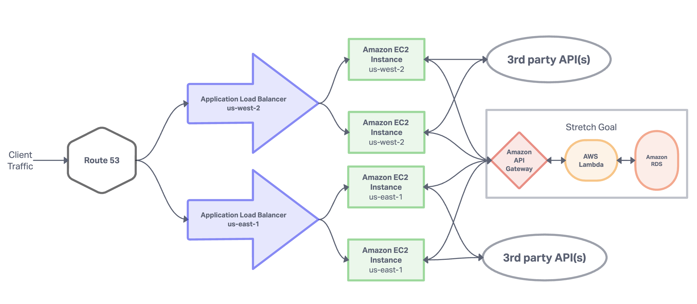

# Deploying an Express Server to EC2 Instances with ALB and Route 53

## Overview

In this lab, students will learn how to deploy an Express server that to an Amazon EC2 instance, create an Application Load Balancer (ALB) that balances the load between multiple EC2 instances, and configure Amazon Route 53 to associate at least two Application Load Balancers (ALBs) with a custom domain name.

Upon completing this lab, students will have acquired practical knowledge in deploying and managing critical AWS services such as EC2, ALB, and Route 53. By leveraging these services, they will ensure high availability and fault protection for their applications, bolstering resilience against potential disruptions and enhancing their overall reliability.

## Prerequisites

Students should have access to their own Free Tier AWS account using appropriate IAM role and cost management to use the necessary services.

## Accommodations

- This lab encourages students to purchase their own custom domain name.  The cost should be less than minimal, however if this presents a financial obstacle, consider providing accommodation to those who need.

- Suggestions for Route 53 alternatives:

  - Pair with a classmate to complete the Route 53 portion of this lab assignment
  - complete the stretch goal instead (perhaps a heavier workload)
  - record a video asset showing students how this could be done and require documentation to explain the process in their assignment submission

## Scope

The lab will develop the following skills:

- Deploying and managing EC2 instances
- Leveraging Amazon Elastic Load Balancing (ELB) by creating an ALB to ensure high availability
- Configuring Route 53 to associate multiple ALBs with a single domain name further bolstering high availability and fault protection.

## Seeds for thought

- The Lambda/RDS/API Gateway stretch goal may prove valuable to reinforce concepts or spark curiosity for future learnings for higher achieving learners.
- The CloudFormation stretch goal is intended to offer insights into infrastructure as code for future labs.

## Architecture Diagram

## Slide Deck

[Learning Assets](https://docs.google.com/presentation/d/1iDUZtOdy-1NSJn97TnrERy-UZnjkOyUpTifpHe6stys/edit?usp=sharing)
